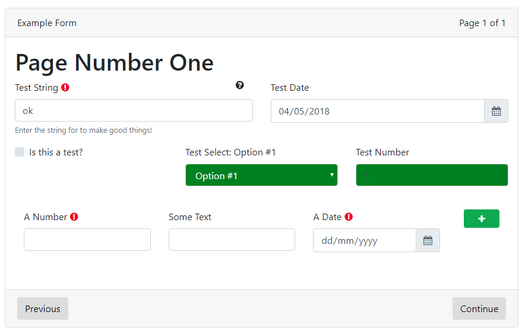

Form definitions is JSON that defines everything about the form, how it functions, what data is available and how it will be presented to the user.

### name 

Type: *string*

This is the name of the form and is free text.

### description

This is the descriptionof the form and is free text.

### author

This is the author of the form in the format: `Author Name <email@example.com>`

### version

This is the version of the form and is a integer value such as `1.0`

### html

The HTML section defines attributes that will modify the output generated by the HTML form generator.
* [prefix](form-def-prefix) - The prefix section defines text or HTML that will be prefixed before the page layout is rendered into HTML.
* [suffix](form-def-suffix) - The suffix section defines text or HTML that will be suffixed after the page layout is rendered into HTML.

### pdf

The PDF section defines attributes that will modify the output generated by the PDF form generator.
* [prefix](form-def-prefix) - The prefix section defines text or HTML that will be prefixed before the page layout is rendered into a PDF.
* [suffix](form-def-suffix) - The suffix section defines text or HTML that will be suffixed after the page layout is rendered into a PDF.

### fields

Defines the fields that are to be available on the form.  Fields must be defined before they can be used in a form and can not be defined in the form pages definition directly, except under certain situations.  Basically, if you want to be able to save a field value, then you must define it here.

[Field Definition Overview](field-definitions)

### pages

Defines the form layout and how it appears visually to the user.  Pages are laid out using *pages* which contain *sections*, which then in turn contain *fields* or *field groups*.

[Page Definition Overview](page-definitions)

# Example

```json
{
    "name": "Example Form",
    "description": "Example form to use for development.",
    "author": "jamie@hazaarlabs.com",
    "version": 1.0,
    "html": {
        "prefix": "<div class=\"card mb-5\"><div class=\"card-header\">Summary</div><div class=\"card-body\">Submission for {{room}}!</div></div>",
        "suffix": "<div class=\"card mb-5\"><div class=\"card-header\">Footer</div><div class=\"card-body\">This is a footer that can display any HTML.</div></div>"
    },
    "pdf": {
        "logo": "http://www.hazaarmvc.com/media/local/Logos/hazaar-icon-lg.png?download=true",
        "head": {
            "link": [
                {
                    "rel": "stylesheet",
                    "href": "style/pdftest.css"
                }
            ],
            "style": [
                ".page-1 { page-break-after: always;  }"
            ]
        },
        "prefix": "<p>Hello, {{name}}.</p><p>Thank your for your submission for a <strong>{{room}}</strong> room.  Below is the data that you submitted to us for review.</p><p>We will process your submission and get back to you as soon as possible.</p>",
        "suffix": "Copyright &copy; 2017 - Hazaar Labs"
    },
    "pages": [
        {
            "label": "Page Number One",
            "sections": [
                {
                    "fields": [
                        [ "testString", "testDate" ],
                        [ "testBool", "testSelect", "testNumber" ],
                        "testList"
                    ]
                }
            ]
        }
    ],
    "fields": {
        "uniqid": {
            "type": "text",
            "label": "Unique Code",
            "format": "AAAA|9999\\AU",
            "placeholder": "AAA9999AA",
            "required": true,
            "tip": "Test string: {{testSelect}}"
        },
        "testString": {
            "type": "text",
            "label": "Test String",
            "required": true,
            "validate": {
                "url": "api/checkString"
            },
            "tip": "This is a test tooltip!",
            "hint": "Enter the string for to make good things!"
        },
        "testDate": {
            "type": "date",
            "label": "Test Date"
        },
        "testNumber": {
            "type": "number",
            "label": "Test Number",
            "css": {
                "background-color": "green"
            }
        },
        "testSelect": {
            "type": "int",
            "label": "Test Select: {{testSelect}}",
            "options": {
                "url": "api/testlist",
                "single": true,
                "other": "other",
                "default": "Option #1"
            },
            "css": {
                "color": "white",
                "background-color": "green"
            },
            "other": true
        },
        "testBool": {
            "type": "boolean",
            "label": "Is this a test?"
        },
        "testList": {
            "type": "array"
            "fields": {
                "listNumber": {
                    "type": "number",
                    "label": "A Number",
                    "required": true
                },
                "listText": {
                    "type": "text",
                    "label": "Some Text"
                },
                "listDate": {
                    "type": "date",
                    "label": "A Date",
                    "required": true
                }
            }
        }
    }
}
```

This will generate a single page form that looks like this:

